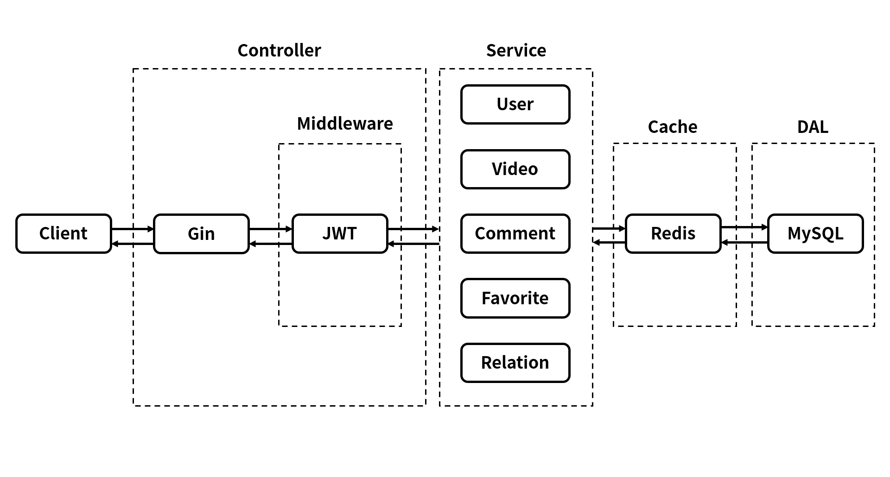

# mini-douyin-ex
A Fully Functional Upgraded Version of https://github.com/zenpk/mini-douyin

## Getting Started

### Build and Run

Run MySQL and Redis first

```sh
export GIN_MODE=release
go build -o mini-douyin cmd/main/main.go
./mini-douyin
```

### Default Config

Edit these configs in `config/const_value.go`

| Key                     | Value         |
| ----------------------- | ------------- |
| IP                      | 101.43.179.27 |
| Port                    | 10240         |
| MySQL Port              | 3306          |
| MySQL Database          | douyin        |
| MySQL username:password | root:root     |
| Redis Port              | 6379          |

### Client Settings

#### Download (Android Only)

You can download the client from [here](https://github.com/zenpk/mini-douyin-ex/raw/main/README/app-release.apk)

#### Settings

Long press "我" at the right bottom to set up server address. You MUST enter the full address (for example in this case, you should input `http://101.43.179.27:10240/`), otherwise the app will crash.

After the app restart, it should be connected to the server.

## Logic

This project has an MVC-like layout, the code is divided into several layers, which can effectively decrease complexity and make it capable for further extension.



## More Information

For more information, please check out [字节跳动青训营——迷你抖音后端功能实现](https://zenpk.vercel.app/mini-douyin)